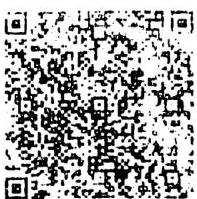

HEUNISCH &amp; FREUN
BGH Gastro GmbH
Seidlgasse 35, 1039
FN 464436w
erben@heunisch.at

# TECHNUNG

|   |  | EUR  |
| --- | --- | --- |
|  Beef Tartar, Belper Knolle |  |   |
|   | 18.00 | 18.00  |
|  x Butter | 1.00 | 1.00  |
|  1 x Salamiteller | 9.00 | 9.00  |
|  1 x handgemachtes Brot | 3.00 | 3.00  |
|  1 x 1/8 PN 2019, Johanneshof Reinisch | 4.00 | 4.00  |
|  1 x 1/8 SL 2019, Paul Achs | 3.00 | 3.50  |
|  1 x 1/8 ZW Alte Reben 2019, Achs | 4.40 | 4.40  |
|  1 x Leitungswasser | 0.00 | 0.00  |
|  1 x Soda Zitrone / Holunder 1/4 | 1.60 | 1.60  |

Rechnungs-Summe in EUR 44,90

|   | Satz | Netto | MwSt. | Summe  |
| --- | --- | --- | --- | --- |
|  EUR | 10 | 28,18 | 2,82 | 31,00  |
|  EUR | 20 | 11,58 | 2,32 | 13,90  |

Summe: 44,90
+ Tip: 3,10

# Mastercard: 48,00

Wir danken für die Preise und freuen uns auf ein Wiedersehen!

cheers -
Weinverkauf zum Mitnehmen (über die Gasse!) sehr gerne möglich!

Rechnungs-Nr.: 69150
UID: ATU71893249

K.14: 1
Fis. Del. Nr.: 1120000
Tisch: 29 24.10.2022 19: 00:00:00

HEUNISCH UND ERBEN
SEIDLGASSE 36
1030 Wien

*** Kundenbeleg ***

Zahlung
MASTERCARD
contactless
XXXX XXXX XXXX 2039

24.10.2022 19:49:53
Trm-Id: 23106921
AID: A0000000041010
Trx Seq-Nr: 47107
Trx Ref. Nr: 57371022410
Autorisierungs-Nr: 471406
Acq-Id: 999100200

Betrag EUR: 48,00
Verified by Device