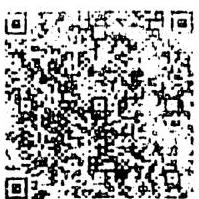
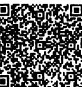

### Page 1

HEUNISCH &amp; FREBEN
BGH Gastro GmbH
Seidlgasse 35, 1039
FN 464436w
erben@heunisch.at

# RECHNUNG

|   |  | EUR  |
| --- | --- | --- |
|  Beef Tartar, Belper Knolle |  |   |
|   | 18.00 | 18.00  |
|  x Butter | 1.00 | 1.00  |
|  1 x Salamiteller | 9.00 | 9.00  |
|  1 x handgemachtes Brot | 3.00 | 3.00  |
|  1 x 1/8 PN 2019, Johanneshof Reinisch | 4.00 | 4.00  |
|  1 x 1/8 SL 2019, Paul Achs | 3.00 | 3.50  |
|  1 x 1/8 ZW Alte Reben 2019, Achs | 4.40 | 4.40  |
|  1 x Leitungswasser | 0.00 | 0.00  |
|  1 x Soda Zitrone / Holunder 1/4 | 1.60 | 1.60  |

Rechnungs-Summe in EUR 44,90

|   | Satz | Netto | MwSt. | Summe  |
| --- | --- | --- | --- | --- |
|  EUR | 10 | 28,18 | 2,82 | 31,00  |
|  EUR | 20 | 11,58 | 2,32 | 13,90  |

Summe: 44,90
+ Tip: 3,10

# Mastercard: 48,00

Wir danken für die Preise und freuen uns auf ein Wiedersehen!

cheers -
Weinverkauf zum Mitnehmen (über die Gasse!) sehr gerne möglich!

Rechnungs-Nr.: 69150
UID: ATU71893249

**Image Description:** The image displays a black and white QR code. QR codes are machine-readable optical labels that can store information such as URLs, contact details, or other text. This particular QR code is composed of a grid of black squares arranged on a white background, forming a specific pattern that can be scanned and interpreted by a QR code reader or smartphone camera.

K.14: 1
Fis. Del. Nr.: 1120000
Tisch: 29 24.10.2022 19: 00:00:00

HEUNISCH UND ERBEN
SEIDLGASSE 36
1030 Wien

*** Kundenbeleg ***

Zahlung
MASTERCARD
contactless
XXXX XXXX XXXX 2039

24.10.2022 19:49:53
Trm-Id: 23106921
AID: A0000000041010
Trx Seq-Nr: 47107
Trx Ref. Nr: 57371022410
Autorisierungs-Nr: 471406
Acq-Id: 999100200

Betrag EUR: 48,00
Verified by Device

### Page 2

# Kolariks Freizeitbetriebe GmbH

1020 Wien, Prater 128

+43 1 7294999

reservierung@kolarik.at

## RECHNUNG

|   |  | EUR  |   |
| --- | --- | --- | --- |
|  3xHofbier 0,5 | 5.40 | 16.20 |   |
|  6xSpritzer rot 1/4 | 3.60 | 21.60 |   |
|  2xSpritzer weiß 1/4 | 3.60 | 7.20 |   |
|  1xWasser 1/4 | 0.00 | 0.00 |   |
|  1xStelze klein | 28.50 | 28.50 |   |
|  1xRipperl 1 Stk. | 23.90 | 23.90 |   |
|  1xKrautsalat | 5.20 | 5.20 |   |

Rechnungs-Summe in EUR 102,60

|  Satz | Netto | NWSt. | Summe  |
| --- | --- | --- | --- |
|  EUR 10 | 52,36 | 5,24 | 57,60  |
|  EUR 20 | 37,50 | 7,50 | 45,00  |

Summe: 102,60

Tip: 7,40

## HaslerCard: 110,00

Zahlung

HASIERCARD

cont

XXXX XXXX XXXX 2039

21.10.2022 21:29:18

Trn-Id: 23516824

AID: A0000000041010

Trx Seq-Nr: 7714

Trx Ref. Nr: 52556974800

Autorisierungs-Nr: 177366

Acq-Id: 999100200

Betrag EUR: 110,00

Trinkgeld EUR: 0,00

Gesamt EUR: 110,00

Verified by Device

Rechnungs-Nr.: 659856

UID: ATU46998405

**Image Description:** The image displays a complex pattern of black and white squares arranged in a grid-like structure. This pattern is characteristic of a QR code, which is a type of matrix barcode. The QR code is densely packed with these squares, creating a highly detailed and intricate design. The contrast between the black and white squares is sharp, making the pattern very distinct. There are no discernible objects or text within the image, as the entire space is occupied by the QR code pattern.

KId:1 FB:ftA5133#640 21.10.2022 21:30:31

Tisch 206 21.10.2022 21:29 10419