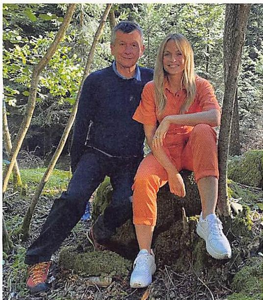
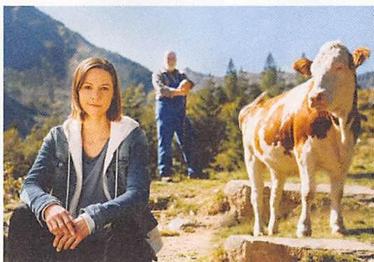
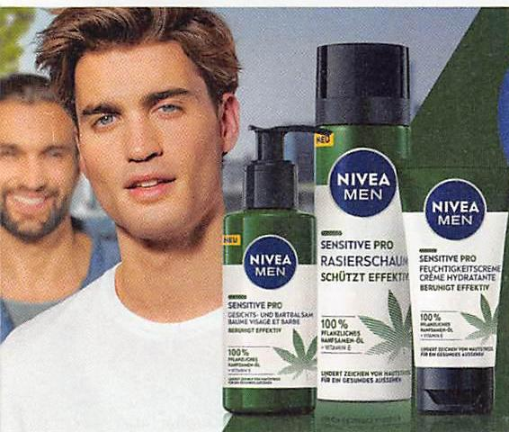
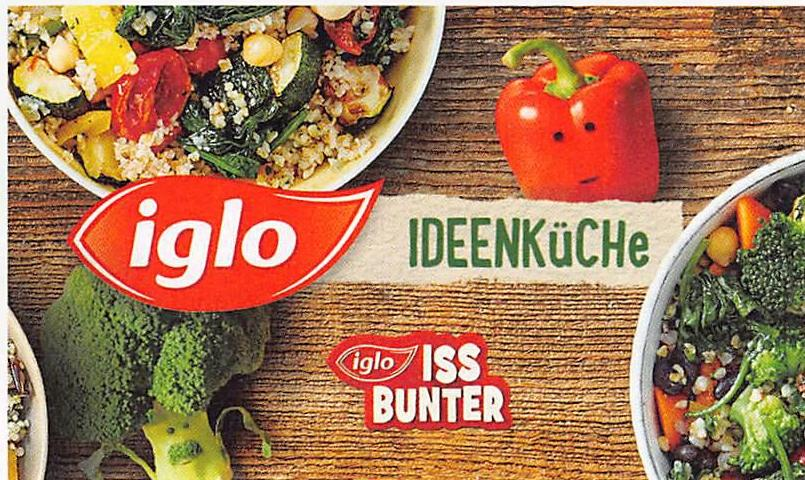

HANDEL TITELSTORY

**Image Description:** In the image, there are two people sitting on a tree stump in a forested area. The person on the left is an older man with gray hair, wearing a dark blue sweater, dark pants, and orange sneakers. The person on the right is a younger woman with blonde hair, wearing an orange jumpsuit and white sneakers. They are both smiling and appear to be enjoying their time outdoors. The background consists of trees and greenery, indicating a natural, wooded environment.

SPAR WERBE-LADY MIRJAM WEICHSELBRAUN
MIT SPAR WERBECHEF DR. FRITSCH

**Image Description:** In the image, there is a young woman sitting on a rock in the foreground. She is wearing a blue jacket with a white zip-up sweater underneath. Behind her, there is a man standing with his arms crossed, wearing a blue shirt and dark pants. To the right of the woman, there is a brown and white cow standing on the grass. The background features a mountainous landscape with trees and clear skies.

POP-SÄNGERIN CHRISTINA STÜRMER ist neue Markenbotschafterin von Lidl.

nen Euro (Plus zehn Prozent) für sich. Hier geht es um Marken und Dachmarken, nicht aber um gesamte Firmen-Aufwendungen oder Einzelartikel. Iglo belegt die Silber-Medaille, AMA erreicht mit plus 49 Prozent den beachtlichen dritten Rang. Zu den starken Marken in der klassischen Werbung zählen nach Focus auch Ja! Natürlich, L'Oreal, Coca Cola und Pampers.

Gesamter Werbemarkt. Print kann in

Die Top 60 Marken
klassische Werbung 2021 (1)

|  Rang | 2020 | 2021 | Diff zum Vorjahr  |
| --- | --- | --- | --- |
|  1 Nivea | 14.120 | 15.526 | 10%  |
|  2 Iglo Tiefkühlkost | 13.367 | 14.364 | 7%  |
|  3 AMA Agrarmarkt Austria | 9.585 | 14.258 | 49%  |
|  4 Milka | 8.040 | 11.522 | 43%  |
|  5 Ja Natürlich Produkte | 9.937 | 11.398 | 15%  |
|  6 L'Oreal Kosmetik | 9.943 | 10.401 | 5%  |
|  7 Coca Cola | 4.420 | 10.253 | 132%  |
|  8 Pampers | 6.931 | 8.595 | 24%  |
|  9 Natur Pur | 6.354 | 7.706 | 21%  |
|  10 Persil | 7.057 | 7.484 | 6%  |
|  11 Nespresso | 13.826 | 7.370 | -47%  |
|  12 Always Damenhygiene | 6.466 | 6.357 | -2%  |
|  13 Lindt | 4.992 | 6.241 | 25%  |
|  14 S-Budget | 1.741 | 6.069 | 249%  |
|  15 Gösser Bier | 3.308 | 5.901 | 78%  |
|  16 Lenor | 5.628 | 5.856 | 4%  |
|  17 Zurück zum Ursprung Produkte | 8.022 | 5.661 | -29%  |
|  18 Nutella | 4.058 | 5.580 | 38%  |
|  19 Nöm Milchprodukte | 5.945 | 5.441 | -8%  |
|  20 Dr Smile unsichtbare Zahnspange | 88 | 5.084 | 5657%  |
|  21 Spar Premium Produkte | 3.734 | 5.037 | 35%  |
|  22 Red Bull | 4.410 | 4.973 | 13%  |
|  23 Head & Shoulders Kosmetik | 3.642 | 4.955 | 36%  |
|  24 Ferrero Rocher | 2.999 | 4.849 | 62%  |
|  25 Ariel | 5.165 | 4.823 | -7%  |
|  26 Schärdinger Käse | 3.889 | 4.699 | 21%  |
|  27 Milchschnitte | 2.402 | 4.618 | 92%  |
|  28 Duplo Schokoriegel | 3.117 | 4.617 | 48%  |
|  29 Schärdinger Milchprodukte | 5.046 | 4.606 | -9%  |
|  30 Tchibo Kaffee | 3.748 | 4.606 | 23%  |

Basis: Bruttowerbewert in Tausend, inkl. handelsbeworbene Insertionen, klassische Werbung
Warenkörbe: Ernährung, Getränke, Kosmetik, Reinigung
*inkl. Spar-Gruppen Werbung
Quelle: Focus

**Image Description:** The image features a young man with short blonde hair and blue eyes, looking directly at the camera. He is wearing a white t-shirt. Behind him, there are three Nivea Men Sensitive Pro products prominently displayed. These products include a shaving foam, a shaving gel, and a moisturizing cream. The packaging is predominantly green with white and blue accents. The text on the packaging indicates that these products are designed for sensitive skin and contain 100% natural almond oil. The background is blurred, drawing focus to the man and the products.

**Image Description:** The image shows a man with short, dark hair and a beard. He is wearing a black shirt and has a slight smile on his face. The background of the image is blurred, making it indistinguishable, but it appears to be an outdoor setting with a hint of greenery. The image is circular in shape, focusing on the man's face and upper shoulders.

ALVARO ALONSO, GF Beiersdorf Österreich und CEE

**Image Description:** The image features a variety of fresh vegetables and dishes, prominently displaying the brand 'iglo'. There are bowls of mixed vegetable salads, including ingredients like broccoli, bell peppers, and leafy greens. The brand logo 'iglo' is visible in red and white, and there is a playful design element where a bell pepper is anthropomorphized with a face. The text 'IDEENKüCHE' and 'iglo ISS BUNTER' are also present, suggesting a focus on creative and colorful cooking ideas.

REGAL 02-2022